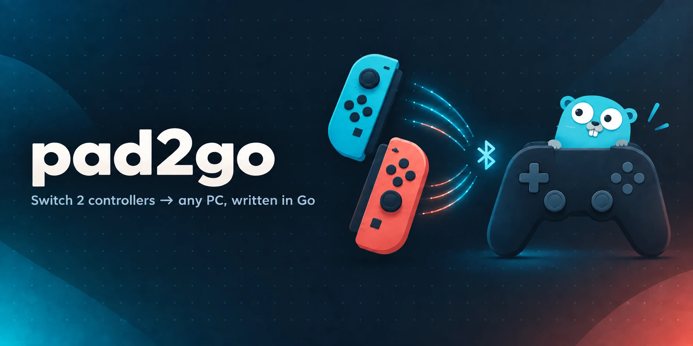

# pad2go



> Not affiliated with or endorsed by Nintendo. Nintendo Switch, Joy-Con and
> related names are trademarks of Nintendo, used here only to describe
> compatibility.

A Go port of [TommyWabg/Switch2Connect](https://github.com/TommyWabg/Switch2Connect):
connect **Switch 2 Joy-Cons**, the **Switch 2 Pro Controller** and the **NSO
GameCube Controller** to a PC over Bluetooth LE and use them as virtual **Xbox
360 controllers**, with an optional **CemuHook/DSU** motion server for emulators.

It is a single static binary with no Python runtime. It also runs on Linux
(uinput) as well as Windows (ViGEmBus), and the DSU server works on macOS too.

Ported from upstream commit `e5dd90b` (2026-09-13).

## Quick start

pad2go is a single executable. Running it opens the Pad2Go window, which
shows players, connection progress, an input test, motion (DSU) and settings.
Settings are saved to `config.yaml` in your user config folder, or to
`./config.yaml` if one exists; use `-config` to choose another.

Then hold **SYNC** on an unpaired controller, or press any button on one
already paired to this PC. Controllers paired by pad2go reconnect with a
button press next time.

Flags:
- `-headless`: run without a window (add `-open` to use the browser).
- `-demo`: simulate controllers, to try the interface without hardware.
- `-v`: debug logging.

`pad2go.log` is written next to the config file.

### Build

```bash
go build ./cmd/pad2go
```

The window uses the system WebView through cgo:
- **macOS:** WKWebView. `packaging/build-macos-app.sh` wraps the executable in
  `Pad2Go.app`, so a double-click opens the window instead of Terminal and
  macOS asks for Bluetooth permission for Pad2Go.
- **Windows:** WebView2, which is preinstalled on Windows 10/11. Build with
  `-ldflags "-H windowsgui"` so no console opens; a MinGW-w64 toolchain is
  needed for cgo.
- **Linux:** WebKitGTK (`libwebkit2gtk-4.0`).

The `nowebview` build tag drops the window and opens the browser instead.
`nobluetooth` builds without Bluetooth, for development with `-demo`.

### Windows

1. Install the [ViGEmBus](https://github.com/nefarius/ViGEmBus) driver.
2. Put `ViGEmClient.dll` (x64) next to `pad2go.exe`.
3. Hide the physical controller from games with HidHide if you see doubled input.

### Linux

Requires BlueZ and write access to `/dev/uinput`:

```bash
sudo modprobe uinput
```

Add a udev rule (e.g. `KERNEL=="uinput", GROUP="input", MODE="0660"`) or run as root.

### macOS

macOS has no virtual gamepad API, so pad2go runs motion-only: turn on
**Movimento** to feed gyro to emulators over DSU. macOS doesn't expose the
adapter MAC, so set it in Ajustes → Conexão if you want pairing.

## Configuration

`pad2go init` writes a commented `config.yaml`. Key names match the
original's `config.yaml`, and an existing original config loads as-is (unknown
keys are ignored; `button_remaps.xbox` overrides apply).

| Key | Meaning |
| --- | --- |
| `output` | `auto`, `vigem`, `uinput` or `none` |
| `host_mac` | this PC's Bluetooth MAC; auto-detected on Windows/Linux |
| `abxy_mode` | `Xbox` (positional: Switch B → Xbox A) or `Switch` (by label) |
| `combine_joycons` | merge a left + right Joy-Con into one pad |
| `default_hold_mode`, `joycon_hold_mode` | `Vertical` / `Horizontal` for single Joy-Cons |
| `gc_trigger_mode` | `Hair Trigger`, `100% at Bump`, `100% at Max` |
| `joystick_deadzone_percent` | per family: `joycon`, `pro_controller`, `nso_gamecube_controller` |
| `vibration_strength_xbox` | 0–10 (5 = 100%) |
| `gyro_passthrough_mode` | `Cemuhook` enables the DSU server (`cemuhook_host`, `cemuhook_port`) |
| `home_mapping`, `capt_mapping`, `c_mapping`, `gl_mapping`, `gr_mapping`, `sll/srl/slr/srr_mapping` | `Default`, `None`, or a Switch button name |

## What was ported

| Feature | Status |
| --- | --- |
| BLE discovery, pairing/bonding, reconnect-by-button | ✅ |
| SW2 init sequence, input format 0x30, feature enable | ✅ |
| Factory/user stick calibration, radial deadzones | ✅ |
| Joy-Con 2 L/R, Pro Controller 2, NSO GameCube (analog triggers, trigger modes) | ✅ |
| Player LEDs, connection haptics | ✅ |
| Joy-Con merging, vertical/horizontal single Joy-Con | ✅ |
| Xbox 360 output via ViGEmBus (Windows) | ✅ |
| Xbox 360 output via uinput (Linux) — new in this port | ✅ |
| Game rumble → HD rumble (LF/HF, strength, delay) | ✅ (basic mapping) |
| CemuHook/DSU motion server | ✅ |
| Extra-button remaps to controller buttons | ✅ |
| Keyboard/mouse/media remaps, gyro mouse, IR mouse | ❌ |
| PS4/PS5 (DualSense) and Switch 1/2 emulation (WinUHid, USBIP) | ❌ |
| Adaptive triggers, audio haptics, Xbox impulse triggers | ❌ |
| ESP32-S3 bridge, wired USB | ❌ |
| Profiles, power saving, auto-disconnect, GUI/tray | ❌ |

The original is ~58k lines of Windows-specific Python. This port covers the
controller protocol and the Xbox path. The drivers, firmware and Windows
integrations above are left out.

### Behavioural differences

- Rumble uses the original's basic ViGEm mapping (`amp = 800·motor/256`, scaled
  by strength, re-sent at 60 Hz). The tuned frequency masks and audio-haptic mixing are not ported.
- For a horizontal right Joy-Con with `abxy_mode: Switch`, the original's
  face-button table is not a rotation of its `Xbox` table. This port uses the
  rotation for both layouts.
- The DSU server converts calibrated [-1, 1] stick values to 0–255. The
  original scaled them as if they were raw 0–4095 readings.

## Performance

Compared with the original Python on the same inputs (Apple M1 Pro), per-report
processing is about 47× faster (12.3 µs → 0.26 µs) and startup drops from ~470 ms/70 MB
to under 10 ms/11 MB. Both add latency far below the BLE link's own 7.5–15 ms.
See [bench/RESULTS.md](bench/RESULTS.md).

## Development

```bash
go test -race ./...
```

Protocol encodings are checked against golden values produced by the original
Python code. The controller handshake is tested against a simulated controller,
and the DSU server over real UDP. `S2C_UINPUT_IT=1` enables an end-to-end uinput
test (needs root and `/dev/uinput`).

Layout:

```
cmd/pad2go   CLI
internal/protocol    BLE protocol: UUIDs, commands, reports, calibration, rumble
internal/controller  per-controller handshake, commands, input, rumble
internal/lifecycle   connection lifecycle: accept, connect, pair, attach, drops
internal/ble         radio adapter over tinygo.org/x/bluetooth
internal/mapping     player pad: remaps, hold mode, Joy-Con pairs, layout, motion
internal/app         player slots, rumble routing, DSU publishing
internal/dsu         CemuHook/DSU UDP server
internal/virtualpad  ViGEmBus (Windows), uinput (Linux), none
internal/service     runtime supervisor: config, restart, snapshot, events
internal/ui          embedded web interface, JSON API, SSE
internal/window      native window (system WebView)
internal/demo        simulated radio for -demo
internal/config      YAML config
```

## License

The banner's gopher is inspired by the Go gopher, designed by Renée French
(CC BY 4.0).


GPL-3.0, same as the upstream project (see `LICENSE`). Protocol knowledge and
constants come from Switch2Connect by TommyWabg.
